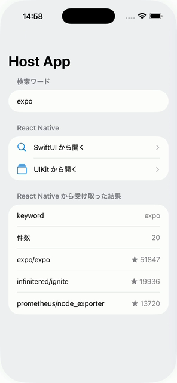
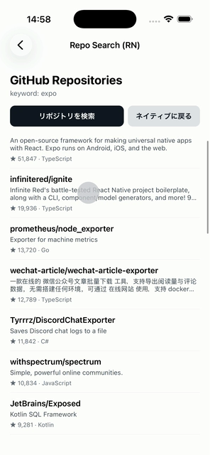

# sample-expo-brownfield

Expo アプリを **既存のネイティブアプリに組み込む（Brownfield）** ためのサンプルです。

React Native 側は「ボタンを押すと GitHub API を `expo` というキーワードで検索し、
リポジトリ一覧を表示する」だけのシンプルな画面で、これを
[`expo-brownfield`](https://docs.expo.dev/versions/latest/sdk/brownfield/) で
XCFramework（Swift Package）に固めて、ネイティブの iOS ホストアプリから表示します。

## デモ

| ネイティブ画面（SwiftUI） | React Native 画面 |
| --- | --- |
|  |  |

ネイティブ側で検索ワードを入力して React Native 画面を開き、検索した結果をネイティブ側に返して表示するまでの往復です。
動画は [こちら](https://www.youtube.com/watch?v=9-VWQvPKPjQ) から参照してください。

左のネイティブ画面には、検索ワードの入力欄、React Native 画面への 2 つの入口
（SwiftUI / UIKit）、そして React Native から受け取った検索結果が並んでいます。
右が組み込まれた React Native 画面です。

```
sample-expo-brownfield/
├── expo-app/     # Expo アプリ本体（ここから XCFramework / AAR を生成する）
│   ├── App.tsx            # 画面を組み立てるだけのエントリポイント
│   ├── src/
│   │   ├── api/github.ts              # GitHub Search API クライアント
│   │   ├── components/ActionButton.tsx
│   │   ├── components/RepositoryRow.tsx
│   │   ├── native/bridge.ts           # initialProps の型 / ネイティブへの通知
│   │   └── screens/RepoSearchScreen.tsx   # 検索画面の本体
│   ├── native/
│   │   ├── ios/RepoSearchBridge.swift      # xcframework に同梱する Swift
│   │   └── android/RepoSearchBridge.kt     # AAR に同梱する Kotlin
│   ├── plugins/withRepoSearchBridge.js     # 上記を各ターゲットに注入する config plugin
│   ├── app.json           # expo-brownfield / expo-build-properties プラグイン設定
│   ├── ios/               # `expo prebuild` の生成物（RepoSearchKit ターゲットを含む）
│   └── android/           # `expo prebuild` の生成物（reposearchkit モジュールを含む）
├── ios-host/     # 生成物を取り込む素の SwiftUI アプリ（XcodeGen でプロジェクト生成）
│   ├── project.yml
│   └── HostApp/
│       └── ContentView.swift       # 検索ワード入力 + 受信結果の表示
└── android-host/ # AAR を取り込む素の Compose アプリ
    ├── settings.gradle.kts         # local-repo/ を Maven リポジトリとして参照
    └── app/src/main/java/.../host/
        ├── MainActivity.kt         # 検索ワード入力 + 受信結果の表示
        ├── RepoSearchActivity.kt   # RN 画面を表示する BrownfieldActivity
        └── RepoSearchViewModel.kt  # 受信結果の保持
```

### `expo-app/ios` と `ios-host` の違い（Android も同様）

紛らわしいので整理します。**どちらも Xcode プロジェクトですが、役割が正反対**です。

| | 何か | 誰が作るか | git 管理 |
| --- | --- | --- | --- |
| `expo-app/ios`<br>`expo-app/android` | **成果物のビルド元**。React Native 本体と `RepoSearchKit` フレームワーク（Android は `reposearchkit` モジュール）が入っており、ここから xcframework / AAR を作る | `expo prebuild` が毎回生成 | 対象外（`.gitignore`） |
| `ios-host`<br>`android-host` | **成果物を取り込む側**。「既存のネイティブアプリ」に相当する、手書きの SwiftUI / Compose アプリ | 人間 | 管理下 |

つまり `expo-app/ios` は Expo アプリを配布可能な形に固めるための作業場で、
`ios-host` がそれを利用する本番相当のアプリです。
`expo-app/ios` を直接編集しても次の prebuild で消えるため、
そこに手を入れたい場合は config plugin を使います（`5-4` を参照）。

## 必要環境

| ツール | バージョン | インストール |
| --- | --- | --- |
| Node.js | 20 以上（動作確認: 24.14.1） | [nodejs.org](https://nodejs.org/) / `brew install node` |
| Xcode | 16 以上（動作確認: 26.3） | App Store |
| CocoaPods | 1.16 以上 | `brew install cocoapods` |
| XcodeGen | 動作確認: 2.x | `brew install xcodegen` |
| Android Studio | SDK 36 / NDK / JDK 17 | [developer.android.com](https://developer.android.com/studio) |

- **CocoaPods** は `expo prebuild` が iOS の依存を解決するために使います。
  Homebrew を使わない場合は `sudo gem install cocoapods` でも構いません。
- **XcodeGen** は `ios-host` の `.xcodeproj` を `project.yml` から生成するために使います。
  `.xcodeproj` は git 管理外なので、`ios-host` を開く前に一度実行が必要です。
- **Android Studio** は Android を扱う場合のみ必要です。SDK Manager から
  **SDK Platform 36 / Build-Tools / NDK / CMake** を入れてください。
  同梱の JBR は JDK 25 で AGP 8.12 の対応範囲外なので、
  ビルド時は `JAVA_HOME` に JDK 17 を指定します（`brew install openjdk@17`）。

> CocoaPods が `Unicode Normalization not appropriate for ASCII-8BIT` で落ちる場合は
> ロケールが未設定です。`export LANG=en_US.UTF-8` を設定してから実行してください。

## 1. Expo アプリ単体で動かす

```bash
cd expo-app && npm install && npm run ios
```

`src/screens/RepoSearchScreen.tsx` の「リポジトリを検索」ボタンで
`https://api.github.com/search/repositories?q=expo&sort=stars` を叩き、
スター順のリポジトリ 20 件を `FlatList` で表示します
（未認証の GitHub Search API は 10 リクエスト/分の制限があります）。

「ネイティブに戻る」ボタンは `expo-brownfield` の `popToNative()` を呼びます。
ホストアプリに組み込んだときだけ効き、単体起動時は何も起きません。

## 2. ネイティブ用のターゲットを生成する（prebuild）

```bash
cd expo-app && npm run prebuild:ios
```

### prebuild とは何をするものか

Expo アプリは通常、ネイティブのプロジェクト（`ios/` `android/`）を持ちません。
`app.json` の設定と依存パッケージから、**必要になったときに生成する**方式だからです。
これを CNG（Continuous Native Generation）と呼び、その生成を行うのが `expo prebuild` です。

生成物は使い捨てで、`.gitignore` の対象です。ネイティブの設定を変えたいときは
`ios/` を直接編集するのではなく `app.json` や config plugin を書き換え、
prebuild し直します。これにより、依存の更新や Expo SDK のアップグレードのたびに
ネイティブ側の差分を手でマージする必要がなくなります。

### brownfield では何が増えるか

素の Expo アプリなら、prebuild が作るのは「アプリを起動するための」プロジェクトです。
brownfield ではそれに加えて、**アプリではなくライブラリとして配布するためのターゲット**が必要で、
それを追加するのが `expo-brownfield` プラグインです。

`app.json` の `expo-brownfield` プラグインが、通常の `expoapp` ターゲットに加えて
**`RepoSearchKit`（フレームワーク）ターゲット**を `ios/` に追加します。
このターゲットが `ReactNativeHostManager` / `ReactNativeViewController` /
`ReactNativeView` を公開し、ホストアプリから使う API になります。

```json
[
  "expo-brownfield",
  {
    "ios": { "targetName": "RepoSearchKit", "bundleIdentifier": "com.example.sample.expo.brownfield.reposearchkit" },
    "android": { "libraryName": "reposearchkit" }
  }
]
```

あわせて `expo-build-properties` の `ios.usePrecompiledModules: true` を有効にしており、
`pod install` が各 Expo モジュールをソースからビルドせずに
ビルド済み `.xcframework` として取得します（ビルドが速く、配布物にもそのまま同梱されます）。

## 3. XCFramework を生成する

```bash
cd expo-app
npm run brownfield:ios          # Release / Swift Package 形式
npm run brownfield:ios:debug    # Debug（Metro に接続する開発用）
```

`expo-app/artifacts/RepoSearchKitPackage-release/` に、
`RepoSearchKit.xcframework` と React / Hermes / 各 Expo モジュールの `.xcframework` 群、
それらをまとめた `Package.swift` が出力されます。

素の XCFramework だけが欲しい場合（Swift Package にしない場合）は次を使います。

```bash
npm run brownfield:ios:xcframeworks
```

### コマンドの実体

```bash
npx expo-brownfield build:ios --release --package RepoSearchKitPackage
```

主なオプション:

| オプション | 説明 |
| --- | --- |
| `-r, --release` / `-d, --debug` | ビルド構成 |
| `-p, --package [name]` | Swift Package として出力（省略すると XCFramework のみ） |
| `-a, --artifacts <path>` | 出力先（既定: `./artifacts`） |
| `--host-provided <names...>` | ホストアプリ側が既に持つフレームワークを除外する |
| `--verbose` | xcodebuild の出力をそのまま流す |

> `.binaryTarget` は構成ごとの切り替えができないため、Swift Package は
> ビルド構成ごとに `-release` / `-debug` のサフィックス付きで出力されます。
> Debug / Release 両方を使いたい場合は 2 回ビルドして使い分けてください。

## 4. ホストアプリから使う

```bash
cd ios-host && xcodegen generate && open HostApp.xcodeproj
```

`project.yml` は `../expo-app/artifacts/RepoSearchKitPackage-release` を
ローカル Swift Package として参照しているので、**先に手順 3 を実行しておく必要があります**。
Xcode で手動で追加する場合は **File → Add Package Dependencies → Add Local** から
同じディレクトリを選びます。

ホストアプリ側のコードはこれだけです。

```swift
// Swift（ios-host/HostApp/HostApp.swift）
import RepoSearchKit

@main
struct HostApp: App {
  init() {
    ReactNativeHostManager.shared.initialize()   // RN ランタイムの起動は一度だけ
  }
  var body: some Scene { WindowGroup { ContentView() } }
}
```

```swift
// Swift（ios-host のコード）

// SwiftUI から
NavigationLink("RN 画面を開く") {
  ReactNativeView(moduleName: "main")
}

// UIKit から
navigationController?.pushViewController(
  ReactNativeViewController(moduleName: "main", initialProps: ["from": "UIKit"]),
  animated: true
)
```

Debug 構成の成果物を組み込んだ場合は、`expo-app` で `npm start` を実行して
Metro を立ち上げてからホストアプリを起動してください。
Release 構成では JS バンドルが `RepoSearchKit.xcframework` に同梱されるため、Metro は不要です。

## 5. ネイティブ ⇄ React Native の連携

### 5-1. 検索ワードをネイティブから渡す（`initialProps`）

検索ワードは JS 側にハードコードせず、ホストアプリから `initialProps` で渡します。

```swift
// Swift（ios-host/HostApp/ContentView.swift）
ReactNativeView(moduleName: "main", initialProps: ["keyword": store.effectiveKeyword])

// UIKit の場合
ReactNativeViewController(moduleName: "main", initialProps: ["keyword": keyword])
```

`initialProps` はルートコンポーネントの props としてそのまま届きます。

```tsx
// TypeScript（expo-app/App.tsx）
export default function App({ keyword }: RootProps) {
  return <RepoSearchScreen keyword={keyword ?? DEFAULT_KEYWORD} />;
}
```

単体起動時は `initialProps` が無いので、`DEFAULT_KEYWORD`（`expo`）にフォールバックします。
ホストアプリ側では `TextField` に入力した値がそのまま次の RN 画面に渡ります。

> `initialProps` が届くのは**画面が作られるときの 1 回だけ**です。
> 開いたままキーワードを差し替えることはできないので、それは `5-3` のメッセージで行います。

### 5-2. 検索結果をネイティブに返す（メッセージ + delegate / クロージャ）

RN 側は検索完了時に `sendMessage()` で結果を投げます。

```ts
// TypeScript（expo-app/src/native/bridge.ts）
export function notifySearchSucceeded(keyword: string, repositories: Repository[]) {
  sendMessage({ type: 'searchSucceeded', keyword, repositories });
}
```

ネイティブ側は `BrownfieldMessaging.addListener` で受け取ります。生のペイロードは
`[String: Any?]` なので、[`RepoSearchBridge`](expo-app/native/ios/RepoSearchBridge.swift) で
型付きの `RepoSearchEvent` に変換し、メインキューで **delegate とクロージャの両方**に流しています。

```swift
// Swift（expo-app/native/ios/RepoSearchBridge.swift と ios-host）
enum RepoSearchEvent {
  case succeeded(keyword: String, repositories: [SearchedRepository])
  case failed(keyword: String, message: String)
}

// delegate で受ける
final class SearchResultsStore: ObservableObject, RepoSearchBridgeDelegate {
  private lazy var bridge = RepoSearchBridge(delegate: self)

  func repoSearchBridge(_ bridge: RepoSearchBridge, didReceive event: RepoSearchEvent) { ... }
}

// クロージャで受ける
let bridge = RepoSearchBridge { event in
  if case let .succeeded(keyword, repositories) = event {
    print("\(keyword): \(repositories.count) 件")
  }
}
bridge.start()
```

サンプルでは SwiftUI 画面が delegate 版、UIKit 画面がクロージャ版を使っています。
リスナーは `start()` / `stop()` で明示的に解除してください（`deinit` でも解除されます）。

> **ペイロードの型に注意**
> - JS の数値は Swift 側で必ず `Double` になります。`as? Int` は常に失敗するので変換が必要です。
> - 配列の要素は `Any?` として渡り、`null` を含むオブジェクトは `[String: Any?]` になります。
> - `NavigationStack` でリンクを push すると root View の `onDisappear` が発火します。
>   リスナーの解除をそこに書くと、RN 画面からのメッセージを取りこぼします
>   （サンプルでは `NavigationStack` 自体に付けています）。

### 5-3. ネイティブから RN にメッセージを送る

`BrownfieldMessaging` は**双方向**です。`5-2` と同じチャンネルを逆向きに使うと、
`initialProps` では届けられない「開いている画面への指示」を送れます。

サンプルでは、RN 画面を開いたままキーワードを差し替えられるようにしています
（iOS はツールバーのメニュー、Android は画面上部のボタン列）。

`RepoSearchBridge` に送信側を足しました。受信側の `RepoSearchEvent` と対になる形です。

```swift
// Swift（expo-app/native/ios/RepoSearchBridge.swift）
public enum RepoSearchCommand {
  case setKeyword(String)
}

bridge.send(.setKeyword("swift"))
```

```kotlin
// Kotlin（expo-app/native/android/RepoSearchBridge.kt）
sealed interface RepoSearchCommand {
  data class SetKeyword(val keyword: String) : RepoSearchCommand
}

bridge.send(RepoSearchCommand.SetKeyword("swift"))
```

JS 側は購読するだけです。

```ts
// TypeScript（expo-app/src/screens/RepoSearchScreen.tsx）
useEffect(
  () => addKeywordListener((next) => setKeyword(next)),
  [],
)
```

受信と違い、送信にリスナーの登録は要りません。メッセージは画面が開いていなくても送られ、
誰も購読していなければ捨てられます。

### 5-4. bridge をフレームワーク / ライブラリ側に持たせる

`RepoSearchBridge`（型変換とイベント定義）は **`RepoSearchKit.xcframework` と
`reposearchkit.aar` の中**にあります。ホストアプリは成果物を取り込むだけで
`RepoSearchEvent` を受け取れて、メッセージのワイヤフォーマットを知る必要がありません。
どちらのホストアプリにも bridge のコードは 1 行もありません。

`ios/` `android/` は `expo prebuild` で毎回作り直されるので、手で追加したファイルは消えます。
そこで自前の config plugin
[`plugins/withRepoSearchBridge.js`](expo-app/plugins/withRepoSearchBridge.js) が、
`native/` 以下のソースを、prebuild のたびに各ターゲットから**直接参照するよう設定**します。

```json
[
  "./plugins/withRepoSearchBridge",
  {
    "ios": { "targetName": "RepoSearchKit", "sources": ["native/ios/RepoSearchBridge.swift"] },
    "android": { "libraryName": "reposearchkit", "sourceDirs": ["native/android"] }
  }
]
```

**Android は簡単です。** ライブラリモジュールのソースセットに `srcDir` を足すだけで済みます。
ただしパッチを当てる `build.gradle.kts` は expo-brownfield が manifest mod で生成するため、
こちらも manifest mod で行う必要があります（Android では dangerous mod が先に走るので、
そこでパッチすると生成物に上書きされます）。

**iOS は Xcode プロジェクトへの登録が必要**で、ここに落とし穴が集中しています。

> - **mod は登録と逆順に実行されます**（自分の action を実行してから、前に登録された mod を呼ぶ）。
>   expo-brownfield の *後* に走らせたいので、`plugins` 配列では **expo-brownfield より前**に置きます。
> - pbxproj のターゲット名は `"RepoSearchKit"` とクォート付きで格納されています。
> - フレームワークターゲットのコンパイルフェーズは、コメントが `Sources` ではなく
>   **ターゲット名**で登録されています。そのため `addSourceFile()` はこれを見つけられず、
>   **エラーも出さずにアプリ側ターゲットにファイルを追加します**
>   （ビルドは通るのにフレームワークにシンボルが入らない、という分かりにくい失敗になります）。
>   ターゲットからフェーズを直接引く必要があります。
> - グループがディレクトリのパスを持っているので、ファイル参照は**ベース名だけ**にします
>   （`<target>/<file>` を渡すと `<target>/<target>/<file>` に解決されて
>   `Build input file cannot be found` になります）。
> - xcframework を作り直したら **Xcode の DerivedData を消してください**。
>   ローカル Swift Package のバイナリターゲットはキャッシュされるため、
>   古い API のままビルドされて `cannot find type ... in scope` になります。
>   Android も同様で、同じバージョンで publish し直したときは
>   `./gradlew --refresh-dependencies` が必要です。

#### テスト

責務ごとに分けています。

| 対象 | 場所 | 内容 |
| --- | --- | --- |
| `src/` の実装 | `expo-app` (Jest) | API クライアント、ネイティブへの通知、検索画面 |
| bridge と組み込み | `ios-host` (XCTest) / `android-host` (JUnit + Robolectric) | ペイロードの型変換、イベント配信、ホスト側の状態管理 |

```bash
cd expo-app    && npm test                  # 20 tests
cd ios-host    && xcodebuild test -project HostApp.xcodeproj -scheme HostApp \
                    -destination 'platform=iOS Simulator,name=iPhone 17'   # 18 tests
cd android-host && ./gradlew testDebugUnitTest                             # 20 tests
```

bridge のテストをホストアプリ側に置いているのは、**成果物を利用する側から公開 API を検証できる**
からです。`RepoSearchBridge.receive(_:)` がメッセージ 1 件を受け取る公開の入口になっているので、
React Native ランタイムを立ち上げずに型変換とイベント配信を検証できます。

カバーしているのは、実際に踏んだ失敗そのものです。

- JS の数値が `Double` で渡ること（`as? Int` / `as? Int` 相当が失敗する）
- `null` の代わりに送っている空文字を `null` に戻すこと
- 必須フィールドを欠いた要素や無関係なメッセージを黙って捨てること
- delegate（listener）とクロージャの両方に、メインスレッドで届くこと

`expo-app` 側は Jest を使っていますが、**SDK 57 に対応した `jest-expo` の安定版がまだ無い**ため
（`react-native/jest-preset` の移設に追随していない）、`@react-native/jest-preset` を直接使い、
Metro に影響しないようテスト専用の Babel 設定 `jest.babel.config.js` を置いています。
また `@testing-library/react-native` v14 では `render` が **async** になっている点に注意してください。

#### `native/` の編集について

生成先にファイルはコピーされません。**実体は `native/` の 1 つだけ**で、
生成されたプロジェクトがそこを参照します。

```
# iOS: pbxproj のファイル参照が SOURCE_ROOT（= ios/）からの相対パスで native/ を指す
path = "../native/ios/RepoSearchBridge.swift"; sourceTree = SOURCE_ROOT;

# Android: ライブラリモジュールのソースセットに native/ を足す
sourceSets { getByName("main") { java.srcDir("../../native/android") } }
```

Xcode / Android Studio 上ではターゲットのメンバーとして通常どおり表示され、
編集・保存すると `native/` の実体がそのまま更新されます。
複製が存在しないので、「生成先を編集してしまい prebuild で失われる」事故は起こりません。

> **シンボリックリンクでは解決しません。**
> Xcode の保存は `FileManager.replaceItem(at:withItemAt:)` を経由しますが、
> この API はシンボリックリンクを元ファイルとして受け付けず、
> `The document "..." could not be saved. The file doesn't exist.` で失敗します。
> リンクにすると IDE から編集できなくなります。

### 5-5. RN インスタンスの破棄とメモリ

`ReactNativeHostManager.shared.initialize()` で作られる React Native インスタンスは
**アプリ内で 1 つだけ**で、RN 画面を開いたり閉じたりしても使い回されます。
2 回目以降の表示が速いのはこのためです。

このインスタンスごと破棄してメモリを戻す API も用意されています。

```swift
// Swift（ホストアプリ側で呼ぶ）
ReactNativeHostManager.shared.cleanupPreviousInstance()
```

**本サンプルでは呼んでいません。** brownfield は「RN 画面を何度も行き来する」前提なので、
インスタンスを保持したままにしています。破棄すると次に開くときの起動コストが再びかかるため、
**メモリと起動速度のトレードオフ**になります。

呼ぶとすれば「RN のセクションから完全に抜けたとき」です。たとえば、アプリの一部の機能だけが
React Native で、そのフローを抜けたら当分戻らないと分かっている場合などです。
逆に、タブの 1 つが RN 画面といった構成では、保持したままの方が快適です。

呼んだあとに再び RN 画面を表示する場合は、`initialize()` からやり直す必要があります。

#### 実際に測った結果

「何度も操作するとメモリが増え続けるのでは」という懸念があったので計測しました。
結論として、**このサンプルの範囲ではリークは確認できませんでした**。

Android（`adb shell dumpsys meminfo`）で検索を 10 回繰り返した場合:

| 回数 | PSS | Native Heap |
| --- | --- | --- |
| 0（検索前） | 139 MB | 17.4 MB |
| 1 | 172 MB | 23.4 MB |
| 5 | 173 MB | 23.9 MB |
| 10 | 173 MB | 23.8 MB |

初回に増えたあとは横ばいです。「開く → 検索 → 戻る」を 6 サイクル繰り返しても 178MB で安定し、
**`Activities` / `Views` / `AppContexts` の数が一定**でした。Activity や View がリークしていれば
ここが毎回増えるので、破棄は正しく行われています。

iOS（シミュレータプロセスの RSS）で検索を 8 回:

| 時点 | RSS |
| --- | --- |
| 検索前 | 321 MB |
| 1 回後 | 356 MB |
| 4 回後 | 381 MB |
| 8 回後 | 382 MB |
| 20 秒放置後 | 285 MB |

4 回目以降はほとんど増えず、放置すると検索前より下がりました。
連打中に増えて見えるのは回収が追いついていないだけで、保持されているわけではありません。

> 上記の iOS の数値は **Debug ビルドをシミュレータで測ったもの**です。
> dev support が載る分、実アプリより多めに出ます。正確に評価するなら、
> Release ビルドを実機で Instruments（Allocations / Leaks）を使ってください。
> Android の値もエミュレータのものです。

### ネイティブ → RN の 3 つの手段

| 手段 | 向き | タイミング | 用途 |
| --- | --- | --- | --- |
| `initialProps` | ネイティブ → RN | **画面生成時の 1 回だけ** | 起動パラメータ |
| メッセージ | 双方向 | いつでも | 「〜が起きた」「〜してほしい」という単発の指示 |
| 共有ステート（`BrownfieldState` / `useSharedState`） | 双方向 | いつでも | 継続的に同期したい値（ログイン状態、テーマなど） |

本サンプルは前 2 つを使っています。共有ステートは `expo-brownfield` が提供していますが、
このサンプルでは使っていません。

### API 一覧

`expo-brownfield` が用意している API:

| JS | Swift | 用途 |
| --- | --- | --- |
| `popToNative(animated)` | — | RN 画面を閉じてネイティブに戻る |
| — | `ReactNativeHostManager` | RN インスタンスの初期化と破棄（`5-5`） |
| `setNativeBackEnabled(enabled)` | — | ネイティブの戻る操作の有効/無効 |
| `sendMessage` / `addMessageListener` | `BrownfieldMessaging` | 双方向メッセージ |
| `useSharedState(key)` | `BrownfieldState` | ネイティブと共有する状態 |

## 6. Android（AAR）

### 6-1. AAR を生成する

```bash
cd expo-app
npm run prebuild:android      # expo prebuild --platform android
npm run brownfield:android    # expo-brownfield build:android --release
```

`app.json` の `expo-brownfield` プラグインが `android/reposearchkit/` に
ライブラリモジュールを生成し、`android.publishing` の設定に従って
`android-host/local-repo/` へ Maven 形式で publish します。

```json
"android": {
  "libraryName": "reposearchkit",
  "package": "com.example.sample.expo.brownfield.reposearchkit",
  "group": "com.example.sample.expo.brownfield",
  "version": "1.0.1",
  "publishing": [
    { "type": "localDirectory", "name": "hostAppRepo", "path": "../android-host/local-repo" }
  ]
}
```

`publishing` を省略すると `mavenLocal()`（`~/.m2/repository`）に publish されます。
`path` は **Expo プロジェクトのルート（`expo-app/`）からの相対パス**で、
prebuild 時に絶対 URL として `android/build.gradle` に書き込まれます。

利用可能な publish タスクとリポジトリは次で確認できます。

```bash
npx expo-brownfield tasks:android
```

### 6-2. ホストアプリから使う

`android-host/settings.gradle.kts` が `local-repo/` を Maven リポジトリとして参照し、
`app/build.gradle.kts` が AAR を依存に追加しています。

```kotlin
// Kotlin（android-host/settings.gradle.kts と app/build.gradle.kts）

// settings.gradle.kts
dependencyResolutionManagement {
  repositories {
    google()
    mavenCentral()
    maven { url = uri("${rootDir}/local-repo") }
  }
}

// app/build.gradle.kts — group : libraryName : version
implementation("com.example.sample.expo.brownfield:reposearchkit:1.0.1")
```

> ホストアプリから `BrownfieldMessaging` を直接使う場合は、
> `implementation("expo.modules.brownfield:expo.modules.brownfield:57.0.14")` の追加が必要です。
> `expo-brownfield` 本体は AAR の Gradle module metadata 上 **runtime スコープ**でしか
> 依存に含まれないためです（`local-repo/` に一緒に publish されています）。
> 本サンプルは bridge をライブラリ側に持たせているので、この依存は不要になりました。

RN 画面は `BrownfieldActivity` を継承した Activity で表示します。
最短の書き方は `showReactNativeFragment()` の 1 行ですが、
**この関数は launch options を受け取れません**。検索ワードを initialProps として
渡したいので、サンプルでは同関数の中身を展開して
`ReactNativeViewFactory.createFrameLayout()` に `Bundle` を渡しています。

```kotlin
// Kotlin（android-host/app/src/main/java/.../RepoSearchActivity.kt）
class RepoSearchActivity : BrownfieldActivity() {
  override fun onCreate(savedInstanceState: Bundle?) {
    super.onCreate(savedInstanceState)
    val keyword = intent.getStringExtra(EXTRA_KEYWORD) ?: DEFAULT_KEYWORD

    ReactNativeHostManager.shared.initialize(application)
    setContentView(
      ReactNativeViewFactory.createFrameLayout(this, this, "main", bundleOf("keyword" to keyword))
    )
    setUpNativeBackHandling()
  }
}
```

`AndroidManifest.xml` では AppCompat の NoActionBar テーマと `configChanges` が必要です。

```xml
<!-- android-host/app/src/main/AndroidManifest.xml -->
<activity
    android:name=".RepoSearchActivity"
    android:theme="@style/Theme.AppCompat.Light.NoActionBar"
    android:configChanges="keyboard|keyboardHidden|orientation|screenLayout|screenSize|smallestScreenSize|uiMode" />
```

### 6-3. 検索結果を受け取る

iOS と同じ形で、`BrownfieldMessaging` を
[`RepoSearchBridge`](expo-app/native/android/RepoSearchBridge.kt)
が型付きイベントに変換し、**listener（delegate 相当）とラムダの両方**に流します。
Compose 画面が listener 版、`RepoSearchActivity` の Toast がラムダ版です。

```kotlin
// Kotlin（expo-app/native/android/RepoSearchBridge.kt と android-host）
sealed interface RepoSearchEvent {
  data class Succeeded(val keyword: String, val repositories: List<SearchedRepository>) : RepoSearchEvent
  data class Failed(val keyword: String, val message: String) : RepoSearchEvent
}

val bridge = RepoSearchBridge(onEvent = { event -> ... })
bridge.start()
```

> **Android 固有の注意点**
> - `sendMessage` のペイロードに **入れ子の `null` を含められません**。
>   `Cannot convert '[object Object]' to a Kotlin type. Value is null, expected an Object`
>   で失敗するため、`src/native/bridge.ts` では `null` になりうる値を空文字に落として送り、
>   ネイティブ側で空文字を `null` に戻しています。
> - `BrownfieldMessaging` のリスナーは Activity のライフサイクルに紐づかないグローバルなものです。
>   RN 画面は別 Activity なので、リスナーは `onCreate` で登録して `onDestroy` で解除し、
>   結果は ViewModel に保持しています（iOS の `NavigationStack` の話と同じ理由です）。
> - `SafeAreaView` は iOS でしか inset が効かないので、
>   Android ではステータスバーぶんの `paddingTop` を自前で入れています。

### 6-4. ビルドと実行

```bash
cd android-host
./gradlew installDebug
```

`local.properties` に SDK の場所を書くか、`ANDROID_HOME` を通しておいてください。

```
sdk.dir=/Users/<you>/Library/Android/sdk
```

> Android Studio 同梱の JBR は JDK 25 で、AGP 8.12 の対応範囲外です。
> `JAVA_HOME` に JDK 17 を指定してください（`brew install openjdk@17`）。

> **同じバージョンで publish し直さないでください。**
> Gradle は依存の解決結果だけでなく、**AAR を展開した結果（`~/.gradle/caches/*/transforms/`）も
> キャッシュ**します。`--refresh-dependencies` はこの展開キャッシュを無効化しないため、
> 中身を変えても同一バージョンなら古いクラスがコンパイルに使われ続けます。
> `Unresolved reference` が出るのに AAR の中には確かにそのメソッドがある、という状態になります。
> `app.json` の `android.version` を上げるのが確実です。

## expo-app の npm scripts

`expo-app/package.json` に定義しているコマンドです。すべて `cd expo-app` してから実行します。

### 開発

| コマンド | 内容 |
| --- | --- |
| `npm start` | Metro バンドラーを起動する。ホストアプリに Debug 構成の成果物を組み込んでいるときに必要 |
| `npm run ios` | Expo アプリ単体を iOS シミュレータでビルド・起動する（`expo run:ios`） |
| `npm run android` | 同じく Android エミュレータで起動する（`expo run:android`） |
| `npm run web` | ブラウザで起動する |

`ios` / `android` は **`ios-host` / `android-host` ではなく Expo アプリ単体**を起動します。
RN 画面だけを素早く確認したいときに使います。

### 検証

| コマンド | 内容 |
| --- | --- |
| `npm test` | Jest。`src/` の実装をテストする |
| `npm run typecheck` | `tsc --noEmit`。型エラーの検査のみ |
| `npm run lint` | Biome。lint とフォーマットの検査のみ |
| `npm run lint:fix` | Biome。検出した問題を自動修正する |

### ネイティブプロジェクトの生成

| コマンド | 内容 |
| --- | --- |
| `npm run prebuild` | iOS / Android 両方を作り直す（`--clean` 付き） |
| `npm run prebuild:ios` | iOS のみ作り直す |
| `npm run prebuild:android` | Android のみ生成する |

`--clean` は既存の `ios/` `android/` を削除してから作り直します。
手を加えていない生成物なので、消えて困るものはありません。

### 成果物の生成

| コマンド | 内容 |
| --- | --- |
| `npm run brownfield:ios` | Release の xcframework を Swift Package として出力する。通常はこれ |
| `npm run brownfield:ios:debug` | Debug 版。JS は同梱されず Metro に接続する |
| `npm run brownfield:ios:xcframeworks` | Swift Package にせず、素の xcframework だけを出力する |
| `npm run brownfield:android` | Release の AAR を生成し、`android-host/local-repo/` に publish する |

### 補助

| コマンド | 内容 |
| --- | --- |
| `postinstall` | `patch-package` を実行する。`npm install` のたびに自動で走り、`patches/` のパッチを当てる（`既知の問題 1` を参照） |

## Lint / フォーマット

| 対象 | ツール | 設定 |
| --- | --- | --- |
| TypeScript / JavaScript / JSON / Markdown | [Biome](https://github.com/biomejs/biome) | [`expo-app/biome.json`](expo-app/biome.json) |
| Swift | swift-format（Xcode 同梱） | [`.swift-format`](.swift-format) |

```bash
cd expo-app && npm run lint        # 検査のみ
cd expo-app && npm run lint:fix    # 自動修正

./scripts/swift-format.sh          # 検査のみ
./scripts/swift-format.sh --fix    # 自動修正
```

VS Code を使う場合は [`.vscode/extensions.json`](.vscode/extensions.json) の推奨拡張を入れると、
保存時のフォーマットと import の整理が有効になります。

Swift に SwiftLint ではなく swift-format を使っているのは、**Xcode に同梱されていて
追加インストールが不要**なためです。本リポジトリは元々 Xcode を要求するので、
これ以上の前提を増やさずに済みます。ルールは swift-format の既定値をそのまま使い、
インデントだけ本プロジェクトに合わせています。

Kotlin には lint を入れていません（必要なら ktlint / detekt が候補です）。

## CI / リリース

[`.github/workflows/`](.github/workflows) に 2 つのワークフローがあります。

### CI（`ci.yml`）

Pull Request の作成・更新・再オープンで走ります。

| ジョブ | ランナー | 内容 |
| --- | --- | --- |
| `expo-app` | ubuntu | `npm run lint` / `typecheck` / `test` |
| `iOS` | macOS | swift-format の検査 → prebuild → xcframework のビルド → ホストアプリのテスト |
| `Android` | ubuntu | prebuild → AAR のビルドと publish → ホストアプリのテスト |

ホストアプリのテストは**成果物に依存する**ため、ジョブ内で先に xcframework / AAR を
作ってから実行します。ここが通れば「ビルドできて、かつ組み込んだ状態で動く」ことの確認になります。

バージョンはリポジトリ直下のファイルで固定しています。
ローカルと CI で同じものを使うためです。

| ファイル | 用途 |
| --- | --- |
| `.node-version` | Node.js のバージョン。`actions/setup-node` の `node-version-file` が読む |
| `.xcode-version` | Xcode のバージョン。ランナー同梱の `xcodes` CLI で選択する |

`actions/*` などのアクションは**コミット SHA で固定**しています
（[GitHub の推奨](https://docs.github.com/en/actions/security-for-github-actions/security-guides/security-hardening-for-github-actions#using-third-party-actions)）。
更新時は SHA と行末のバージョンコメントを揃えて変更してください。

キャッシュしているもの:

| 対象 | 効果 |
| --- | --- |
| npm（`setup-node`） | 依存のダウンロード |
| CocoaPods のダウンロードキャッシュ | podspec と pod ソースの取得 |
| `ExpoModulesJSI.xcframework` | pod install 中のソースビルド。ビルドスクリプト自身がソースとツールチェーンのハッシュで再検証するため、古い復元は自動で作り直される |
| Gradle（`setup-gradle`） | 依存と configuration cache |

**リリースワークフローではビルドキャッシュを使いません。** 古い復元が混入すると
誤ったバイナリを配布してしまうためです。

### リリース（`release.yml`）

`1.0.0` のようなバージョン番号のタグを push すると走ります（`v` の接頭辞は不要です）。

`workflow_dispatch` での手動実行にも対応しています。この場合は**タグを先に用意する必要はありません**。

1. ブランチとバージョン番号を選んで実行する
2. そのタグが既にあれば、その時点で終了する（リリース済みのバージョンを
   別のコミットから作り直さないため）
3. 無ければ、選択したブランチの HEAD から成果物をビルドする
4. ビルドが通ったら、そのコミットにタグを打って Release を作成する

タグを打つのは**ビルドが成功した後**です。先に打つと、ビルドが失敗したときに
タグだけが残り、次の実行が手順 2 で弾かれてしまいます。
成果物を GitHub Release に添付します。

| ファイル | 内容 |
| --- | --- |
| `RepoSearchKitPackage-<tag>-spm.zip` | Swift Package 形式。Xcode の **Add Local** で追加する。本サンプルが使っている形 |
| `RepoSearchKit-<tag>-xcframeworks.zip` | 素の xcframework 10 個。SPM を経由せず自前で組み込む場合はこちら |
| `reposearchkit-<tag>-maven-repo.zip` | Maven リポジトリ一式。POM と Gradle module metadata を含む |
| `reposearchkit-<tag>.aar` | AAR 単体 |

Android は AAR 単体だけでなくリポジトリ一式も添付しています。
`react-android` と `hermes-android` のバージョンは Gradle module metadata で解決されるため、
AAR だけでは依存を引けないからです。

> iOS の成果物は圧縮後でも数百 MB になります（xcframework に全アーキテクチャの
> React Native と Hermes が入るため）。

## 動作確認の状況

iOS / Android とも、**ネイティブ → RN への検索ワード受け渡し**、**RN → ネイティブへの結果通知（20 件）**、
**ネイティブ画面への復帰**まで通しで確認済みです。

| | 環境 | 生成物 |
| --- | --- | --- |
| iOS | Xcode 26.3 / iPhone 17 シミュレータ | `artifacts/RepoSearchKitPackage-release/`（約 400MB、10 個の xcframework） |
| Android | Android Studio (SDK 36 / NDK 30 / JDK 17) / Pixel 10 エミュレータ | `android-host/local-repo/`（約 6.4MB、`reposearchkit-1.0.1.aar` は約 590KB） |

共通の土台は Expo SDK 57.0.16 / React Native 0.86.2 です。
どちらも Release 構成なので JS バンドルは成果物に同梱され、Metro なしで動作します。

自動テストは 3 つのプロジェクトで計 58 件が通ります（`5-4` のテストを参照）。

## 既知の問題

### 1. `expo-modules-jsi` のビルドエラー（パッチ適用済み）

Expo SDK 57 (`expo-modules-jsi@57.0.5`) の `RuntimeScheduler.h` は、コンストラクタに
`SWIFT_RETURNS_RETAINED` を付けているため Swift の C++ interop がエラーになり、
`ExpoModulesJSI.xcframework` のビルドに失敗します。

```
error: 'RuntimeScheduler' cannot be annotated with either SWIFT_RETURNS_RETAINED
       or SWIFT_RETURNS_UNRETAINED because it is not returning a SWIFT_SHARED_REFERENCE type
```

本サンプルでは [patch-package](https://github.com/ds300/patch-package) で該当行を取り除いています
（`patches/expo-modules-jsi+57.0.5.patch`、`npm install` の postinstall で自動適用）。
上流の SDK 58 系では同じ修正が入っているため、SDK を上げる際にこのパッチは削除してください。

### 2. Xcode の Build Location が Custom の場合

`expo-brownfield build:ios` は `-derivedDataPath ios/build` を渡し、成果物が
`ios/build/Build/Products/<Configuration>-iphoneos/` にある前提でフレームワークを探します。
Xcode の **Settings → Locations → Advanced… → Build Location** が
`Custom (relative to workspace)` になっていると、成果物は `ios/Build/Products/...` に出力され、
ビルド自体は成功するのに次のエラーで失敗します。

```
Error: Could not find the compiled brownfield framework in the Xcode build products directory
Missing framework: .../ios/build/Build/Products/release-iphoneos/RepoSearchKit.framework
```

対処はどちらか:

1. Xcode の Build Location を `Unique`（既定）に戻す。
2. `ios/` を生成したあとにブリッジ用のシンボリックリンクを張る（`expo prebuild --clean` のたびに必要）。

```bash
mkdir -p expo-app/ios/build/Build && ln -sfn ../Products expo-app/ios/build/Build/Products
```

## 参考

- [Expo Brownfield SDK](https://docs.expo.dev/versions/latest/sdk/brownfield/)
- [How to add Expo to an existing native app](https://docs.expo.dev/brownfield/get-started/)
